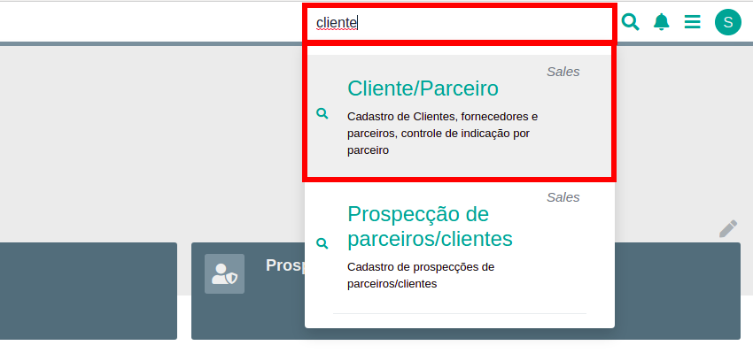
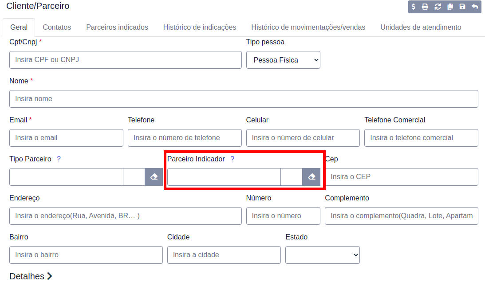
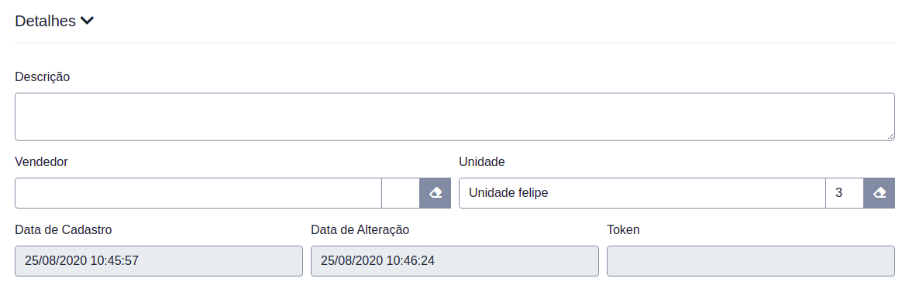
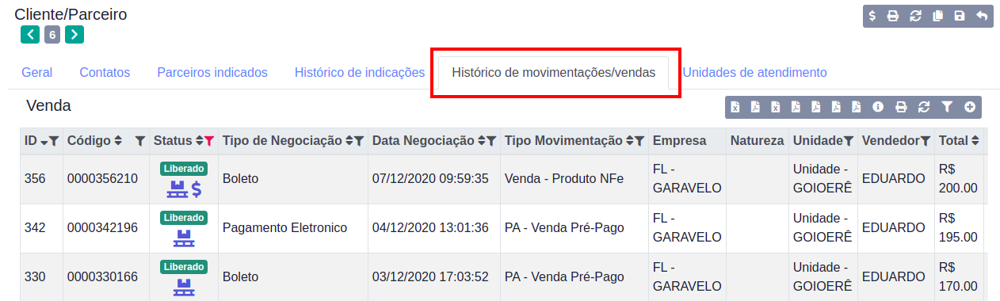
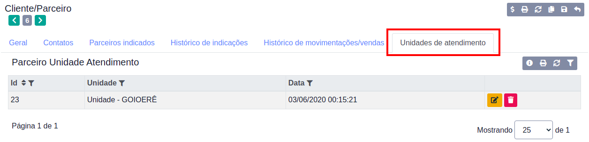
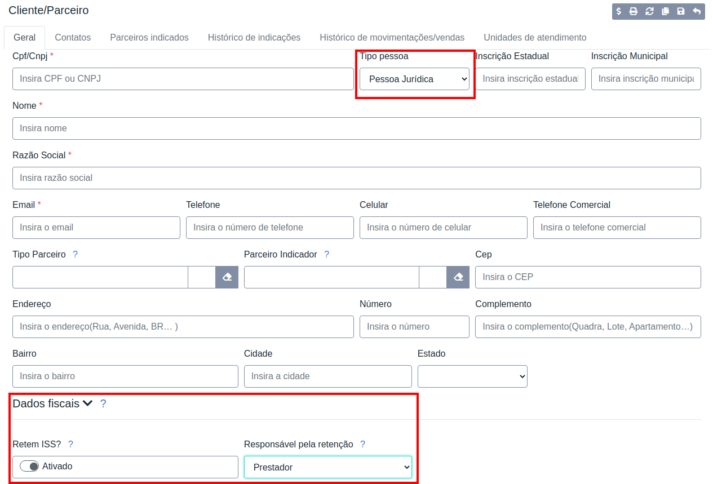

# Cadastro de Cliente

Antes de realizar uma venda, devemos cadastrar um cliente, para isso abrimos a página "Cliente/parceiro" através da barra de pesquisa.

Para adicionar um cliente clique em "Adicionar item" no menu superior direito

Um formulário será aberto, basta preencher as informações referentes ao cliente.

## Indicações

Se o cliente a ser cadastrado for indicado por algum parceiro adicione-o ao campo `Parceiro Indicador`

Caso o cliente seja um parceiro verifique nosso [manual](cadastro_parceiro.md) para cadastro de parceiros indicadores

## Detalhes do Cliente

Através dos detalhes do cliente é possível determinar o vendedor responsável pelo atendimento e uma unidade para o cliente, informações como `Data de Cadastro` e `Data de Alteração` são preenchidas automaticamente pelo sistema.

## Histórico de Movimentações/vendas

Nessa aba são listadas todas as vendas realizadas ao cliente em análise.

Essa aba facilita a navegação e análise de um cliente em específico, ao invés de filtrar pelo cliente na tela de Vendas você pode consultar esse histórico e buscar pelas suas vendas.

## Unidades de atendimento

Aqui é possível analisar as unidades em que o cliente já foi atendido.

## Dados fiscais

Caso o cliente seja pessoa júridica, novos campos serão habilitados na seção `Dados fiscais`, dessa forma se o cliente for substituto tributário marque a opção **`Retem ISS?`** e o responsável pela retenção.

